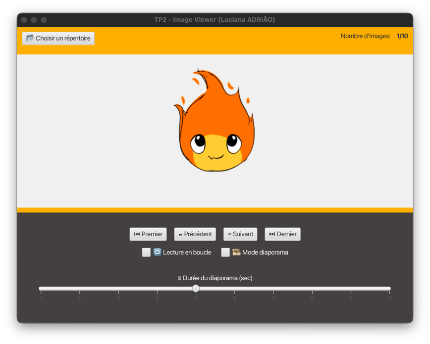

# TP2 - Technologies Java & J2EE
**Developer : Luciana Adrião**

**Majeure: Cybersécurité & Intelligence Artificielle**

## **Description**
Ce projet est une **Image Visualizer**. Il permet à l'utilisateur de **sélectionner un dossier contenant des images** et d'afficher les photos de manière **interactive**, avec la possibilité de **navigation manuelle**, de **diaporama automatique** et d'un **mode en boucle**.

Le projet a été développé en utilisant **Maven** pour la gestion des dépendances.

---

## **📂 Structure du Projet**

Le fichier ZIP contient les répertoires et fichiers suivants :

### 📂 **tp2/** *(Dossier racine du projet)*
- 📂 **src/** 
    - 📂 **main/java/com/example/tp2/** *(Code Java)*
        - **`MainApp.java`** → Classe principale qui lance l'application JavaFX.
        - **`MainController.java`** → Contrôleur responsable de l'interface graphique et de la logique du programme.
        - **`ImageViewer.java`** → Composant qui gère les images et la navigation.
        - **`HelloApplication.java`** → Fichier généré automatiquement par IntelliJ IDEA lors de la création d'un projet JavaFX.
        - **`HelloController.java`** → Fichier généré automatiquement par IntelliJ IDEA lors de la création d'un projet JavaFX.
    - 📂 **main/resources/com/example/tp2/**
        - **`main-view.fxml`** → L'interface graphique de l'application.
        - **`hello-view.fxml`** → Fichier FXML généré automatiquement par IntelliJ IDEA lors de la création d'un projet JavaFX.

---

## **Exécuter l'Application**

### **Prérequis :**
- Java & JavaFX **21**
- Maven
- IntelliJ IDEA 

### **Étapes pour Lancer :**
1. **Extrayez le fichier ZIP dans un dossier local.**
2. **Ouvrez le projet dans IntelliJ IDEA.
3. **Compilez et exécutez le projet** avec Maven
4. **Sélectionnez un dossier contenant des images** (utilisez le dossier **images** inclus, si nécessaire).
5. **Naviguez parmi les images manuellement ou activez le diaporama.**

---

## **Captures d'Écran**

---
Désolée pour mon français, j'utilise un traducteur.